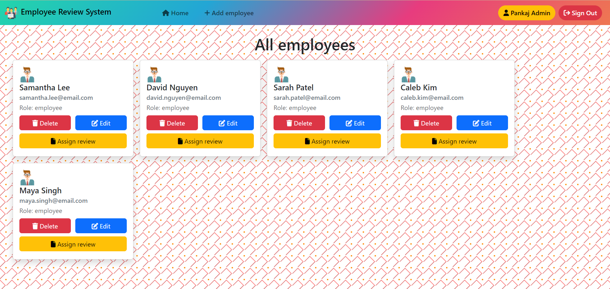
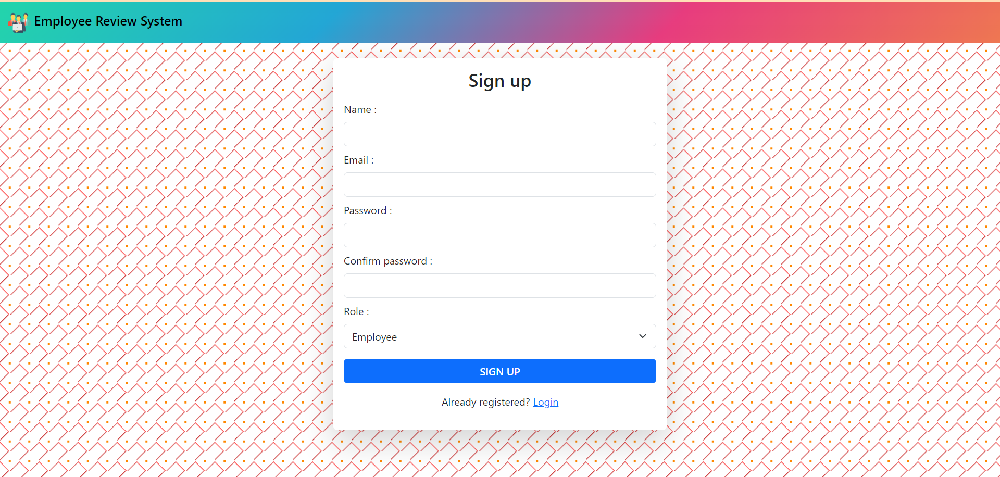
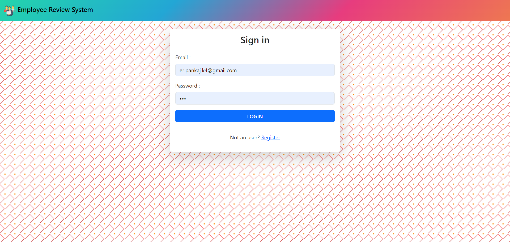
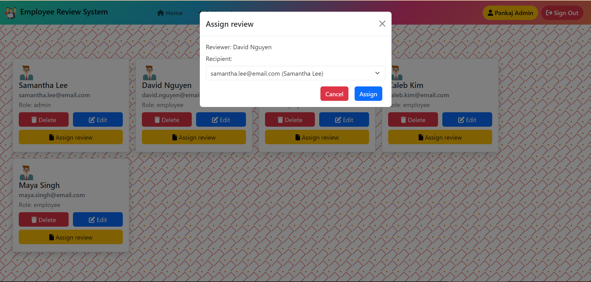
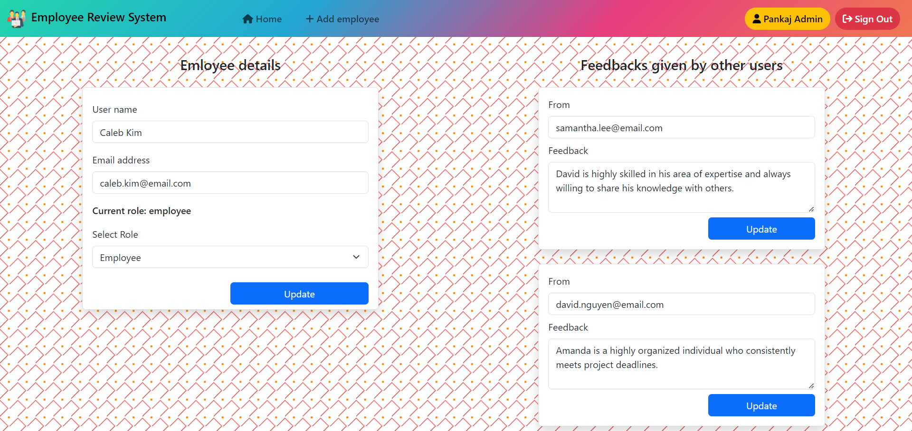
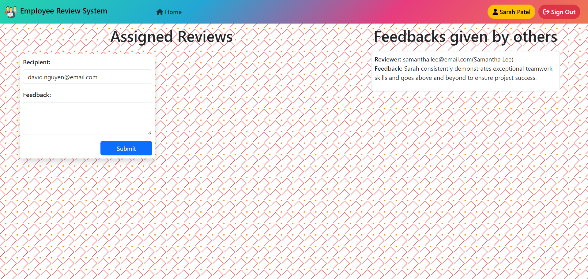

# Employee review system
The Employee Review System is a web application that allows employees to submit feedback towards each other's performance. The system includes admin view capabilities such as employee management and performance review assignment.

## Host link:

## DEMO Video on Youtube:

## Features
- Admin view for managing employees and performance reviews
- Employee view for submitting feedback
- Login for both admin and employee
- Employee registration
- Admin-only capability to promote employees to admin status

### Admin view
- Add/remove/update/view employees
- Add/update/view performance reviews
- Assign employees to participate in another employee's performance review_

### Employee view
- List of performance review requiring feedback
- Submit feedback

## Installation

##### Install NPM dependencies

`npm install`

##### Start your app

`npm start`

#### The Server should now be running at http://localhost:8000/

## 🛠️ Technologies Used
- Bootstrap
- NodeJS
- MongoDB
- ExpressJS
- EJS

### 📚 Libraries:
- passport-jwt
- connect-flash
- express-ejs-layout
- passport-local
- ejs
- mongoose
- express-session
- bcryptjs
- cookie-parser
- connect-mongo
- dotenv
- express

## Folder Structure
📦Employee-review-system 
 ┣ 📂config 
 ┃ ┣ 📜middleware.js 
 ┃ ┣ 📜mongoose.js 
 ┃ ┗ 📜passport-local-strategy.js 
 ┣ 📂controllers 
 ┃ ┣ 📜dashboard_controller.js 
 ┃ ┣ 📜review_controller.js 
 ┃ ┗ 📜users_controller.js 
 ┣ 📂DEMO - Here, app screenshots are present 
 ┣ 📂models 
 ┃ ┣ 📜review.js 
 ┃ ┗ 📜user.js 
 ┣ 📂routes 
 ┃ ┣ 📜index.js 
 ┃ ┣ 📜reviews.js 
 ┃ ┗ 📜users.js 
 ┣ 📂views 
 ┃ ┣ 📜add_employee.ejs 
 ┃ ┣ 📜admin_dashboard.ejs 
 ┃ ┣ 📜edit_employee.ejs 
 ┃ ┣ 📜employee_dashboard.ejs 
 ┃ ┣ 📜layout.ejs 
 ┃ ┣ 📜user_sign_in.ejs 
 ┃ ┣ 📜user_sign_up.ejs 
 ┃ ┗ 📜_header.ejs 
 ┣ 📜.env 
 ┣ 📜.gitIgnore 
 ┣ 📜index.js 
 ┣ 📜package-lock.json 
 ┣ 📜package.json 
 ┗ 📜README.md 

 ## Credits
This project was developed by [Your Name] as a coding exercise. It is not intended for production use.

## License
This project is licensed under the MIT License. Feel free to use and modify the code as you see fit.

